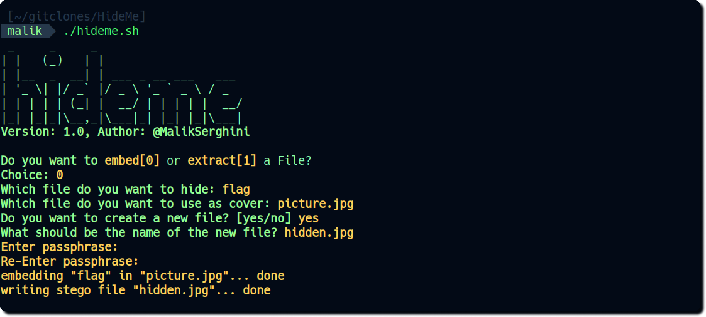
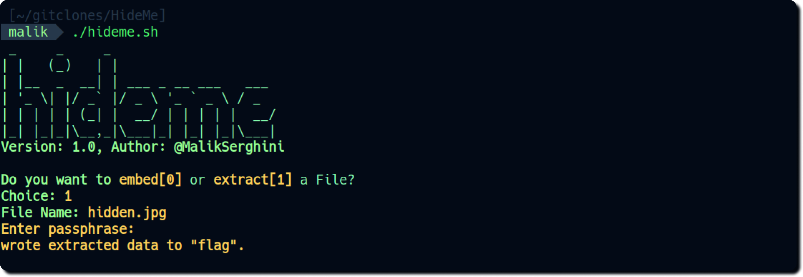

# Steganography Tool

This is a simple steganography tool implemented in Bash. It allows you to embed files within other files using steghide, a steganography program. Additionally, it provides functionality to extract hidden files from cover files.

## Features

- Embed files into other files using steghide.
- Extract hidden files from cover files using steghide.

## Requirements

- [Steghide](https://steghide.sourceforge.net/) (Make sure it is installed on your system. You can install it using package managers like apt or yum.)

## Usage

1. Clone or download the repository to your local machine.
2. Make sure you have Bash and steghide installed on your system.
3. Navigate to the directory containing the script (`hideme.sh`) in your terminal.
4. Make the script executable by running the command:
    ```bash
      chmod +x script.sh
    ```
5. Run the script by executing: `./hideme.sh`
    ```bash
      ./hideme.sh
    ```
6. Follow the on-screen instructions to embed or extract files.

## Instructions

- When prompted, select whether you want to embed or extract a file by entering `0` for embedding or `1` for extracting.
- For embedding:
  - Enter the file you want to hide.
  - Enter the file you want to use as a cover.
  - Choose whether to create a new file or embed into the existing cover.
  - If creating a new file, provide a name for the new file.
- For extracting:
  - Enter the name of the file from which you want to extract hidden data.

## Example

Embedding:

Extracting:
